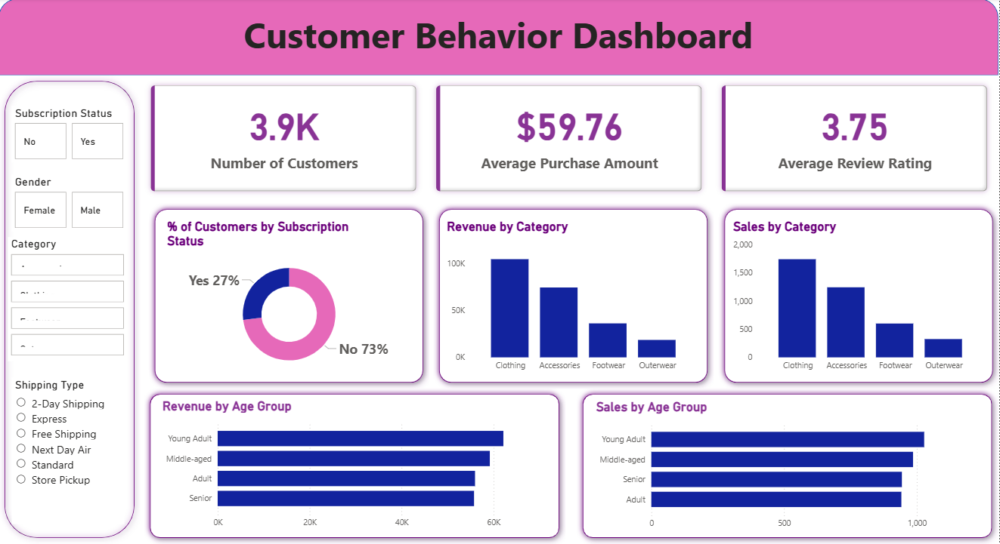

# 📊 End-to-End Customer Behavior Analysis  
### Python • SQL • Power BI • Business Intelligence  

---

## 📌 Project Overview

This project performs a complete **end-to-end customer behavior analysis** using **Python, SQL, and Power BI** to transform raw transactional data into actionable business insights.

### 📊 Dataset Overview

- 3,900 customer records  
- 17 structured features  
- Customer demographics & purchasing behavior  
- Review ratings & subscription status  

---

## 🎯 Business Questions Addressed

- Which customer segment generates maximum revenue?
- What product category drives the highest sales?
- Does subscription impact customer spending?
- Which age group contributes most to revenue?
- What shipping methods are most preferred?

---

## 🧠 Business Problem

The company aimed to:

- Improve revenue through customer segmentation  
- Identify high-performing product categories  
- Optimize marketing strategy  
- Understand subscription impact on purchasing behavior  
- Track sales performance across age groups  

---

## 🛠️ Tech Stack Used

| Tool | Purpose |
|------|---------|
| **Python (Pandas, NumPy, Matplotlib, Seaborn)** | Data Cleaning & EDA |
| **MySQL** | Data Aggregation & Advanced Queries |
| **SQL Window Functions** | Ranking & Category Analysis |
| **Power BI** | Interactive Dashboard Creation |
| **Excel** | Initial Data Validation |

---

## 📂 Project Structure

```
End-to-End-Customer-Behavior-Analysis
│
├── Data/
│   └── customer_shopping_behavior.csv
│
├── Python_EDA/
│   └── Customer_Shopping_Behavior_Analysis.ipynb
│
├── SQL/
│   └── customer_behavior.sql
│
├── PowerBI/
│   └── customer_behavior_dashboard.pbix
│
├── Reports/
│   ├── Business_Report.pdf
│   ├── Presentation.pptx
│   └── Problem_Statement.pdf
│
├── Screenshots/
    └── dashboard.png
```

---

## 🔎 Project Workflow

### 📊 Data Cleaning & EDA (Python)

- Checked missing values  
- Validated data types  
- Removed inconsistencies  
- Performed exploratory data analysis  

---

### 🗄 SQL Analysis

- Category-wise revenue aggregation  
- Sales ranking using `ROW_NUMBER()`  
- Subscription impact analysis  
- Customer segmentation logic  

---

### 📈 Dashboard Development (Power BI)

- KPI Cards  
- Revenue & Sales by Category  
- Revenue & Sales by Age Group  
- Subscription Breakdown  
- Dynamic Filters (Gender, Shipping Type, Category)  

---

## 📊 Dashboard Preview



---

## 📈 Key Insights

- Clothing category generates highest revenue  
- Young Adults contribute maximum sales  
- 73% customers are non-subscribers  
- Subscription customers show higher average purchase value  
- Standard shipping is most preferred  

---

## 📊 KPIs Calculated

- Total Customers  
- Average Purchase Amount  
- Average Review Rating  
- Category-wise Revenue  
- Age-wise Sales Distribution  

---

## 💡 Business Impact

This analysis enables businesses to:

- Identify high-value customer segments  
- Optimize product inventory planning  
- Improve subscription marketing strategies  
- Increase customer retention  
- Enhance revenue forecasting  

---

## 🔥 Skills Demonstrated

- Data Cleaning & Wrangling  
- Exploratory Data Analysis  
- SQL Aggregation & Window Functions  
- Business KPI Development  
- Dashboard Storytelling  
- Data-Driven Decision Making  

---

## 📌 Future Enhancements

- Customer Lifetime Value (CLV) Calculation  
- Churn Prediction Model  
- Profit Margin Analysis  
- Streamlit Web App Deployment  
- Advanced DAX Measures  

---

## 👨‍💻 About Me

Aspiring **Data Analyst** passionate about transforming data into strategic business insights using Python, SQL, and Power BI.

Open to Data Analyst / BI Analyst opportunities.

---

⭐ If you found this project interesting, feel free to star the repository!

⭐ If you found this project interesting, feel free to star the repository!
